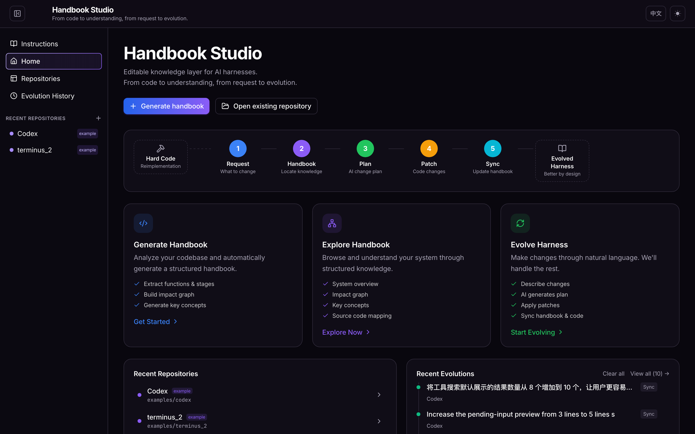
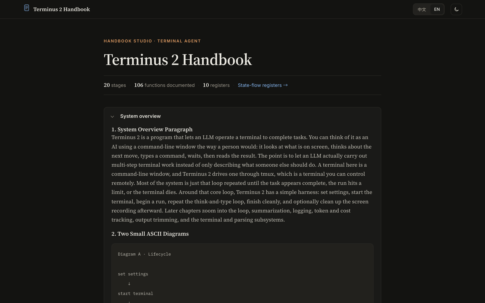

# Harness Handbook（代码库手册）

[English](README.md) | **中文**

[](https://ruhan-wang.github.io/Harness-Handbook/)
[](https://arxiv.org/abs/2607.13285)
[](https://huggingface.co/papers/2607.13285)

把任意代码库转换成一份可导航的 **handbook（手册）**，再用这份手册帮助 code agent
（代码智能体）找到一次改动需要触及的**每一处**位置。

整体分为两步：

1. **生成 handbook**：从源码生成一份分阶段（stage）的结构化代码库地图（markdown +
   可选 HTML）。
2. **把 handbook 当作 helper 使用**：把它接到 code agent 的 planner（规划器）上，
   量化「有手册」相比「没手册」时 agent 定位改动位置的能力提升了多少。

```
handbook_generate_large/    为「大型」代码库生成 handbook
handbook_generate_small/    为「小型」代码库生成 handbook
handbook_as_helper/         用 handbook 作为 code agent 的 planner + resync
```

每个文件夹下都有各自更详细的 `README.md`；本页是端到端的总指南。

### 演示与示例

- **[Handbook Studio](https://ruhan-wang.github.io/Harness-Handbook/studio/index.html)** — 浏览 handbook 的交互演示
- **[Terminus 2 Handbook](https://ruhan-wang.github.io/Harness-Handbook/terminus-handbook/index.html)** — 为 Terminus 2 生成的示例 handbook

<p align="center">
  <a href="https://ruhan-wang.github.io/Harness-Handbook/studio/index.html">
    
  </a>
  <br/>
  <em>Handbook Studio</em>
</p>

<p align="center">
  <a href="https://ruhan-wang.github.io/Harness-Handbook/terminus-handbook/index.html">
    
  </a>
  <br/>
  <em>示例：Terminus 2 Handbook</em>
</p>

---

## 0. 环境准备

```bash
git clone <你的仓库地址>
cd Harness_Handbook          # 或你克隆后的目录名

python3 -m venv .venv && source .venv/bin/activate
pip install tree-sitter tree-sitter-language-pack pyyaml requests markdown pygments
```

**LLM 接入。** 除纯静态分析外的每个阶段都会调用 LLM。**生成器**
（`handbook_generate_*/**/api_client.py`)与 **helper**（其 code agent 与 resync）
都连到同一个 **OpenAI 兼容**接口,用标准 OpenAI 环境变量配置,没有任何硬编码：

```bash
export OPENAI_API_KEY=sk-...                        # 你的 OpenAI API key（必填）
# 可选覆盖：
export OPENAI_MODEL=gpt-4o-mini                     # 默认 gpt-4o-mini
export OPENAI_BASE_URL=https://api.openai.com/v1    # 默认；或任何 OpenAI 兼容接口
                                                    #（自建 vLLM、代理等）
```

任何 OpenAI 兼容接口都可用——把 `OPENAI_BASE_URL` 指过去即可（本地 vLLM、LiteLLM 等），
若接口不需要 key 就用 `OPENAI_API_KEY=EMPTY`。**生成器的 Phase 1 不需要 LLM**，可以先
单独跑一遍验证解析器是否正常。也仍然支持用 `LLM_MODEL` / `LLM_BASE_URL` /
`LLM_API_KEY` 直接覆盖。

---

## 1. 生成 handbook

根据代码库规模选择对应流水线。两者都支持 Python、Rust、TypeScript、Go（以及
Starlark / Shell / PowerShell），并支持 `--lang auto` 自动识别并合并源码根目录下的
所有语言。

### 1A. 大型代码库 → `handbook_generate_large/`

自底向上、**以文件为叶子节点**：读取*每一个*文件，合成一条有序的 stage 主干骨架，
再从叶子向上叙述直到系统总览。覆盖率天然完整——不会静默丢文件，也**无需手写骨架**。

```bash
cd handbook_generate_large

# （可选）只跑 Phase 1：静态调用图，不用 LLM，适合做冒烟测试
python3 run.py --lang auto --source-root /path/to/repo --work-dir work/repo --phase 1

# 完整流程：逐文件深读 → doctor 合成骨架 → 组织 → 叙述 + 生成 HTML
python3 run.py \
    --source-root /path/to/repo \
    --work-dir work/repo \
    --read-detail deep --read-batch-size 1 --read-workers 100 \
    --synth-mode doctor --doctor-workers 32 --doctor-llm-workers 100 \
    --organize-workers 100 \
    --phase3-html

# 中文手册（要用一个「全新」的 work-dir；中文需要重跑 read 阶段）
python3 run.py --source-root /path/to/repo --work-dir work/repo_zh \
    --read-detail deep --read-batch-size 1 --narrate-lang zh --phase3-html
```

关键参数：`--read-detail deep`（整文件深读，配合 `--read-batch-size 1`）、
`--synth-mode doctor`（actor-critic 骨架合成，无需额外凭证）、`--narrate-lang
{en,zh}`（手册语言）、`--phase3-html`（多页 HTML 站点）、`--phase
<all|1|2a|2b|2c|2|3>`（只跑部分阶段）。

**输出** → `work/repo/handbook/`：

```
overview.md            系统总览
index.md               分阶段索引（导航主干）
register.md            跨阶段状态寄存器
stages/<id>.md         每个 stage 一页
html/overview.html     HTML 站点入口（加了 --phase3-html 时）
```

### 1B. 小型代码库 → `handbook_generate_small/`

三个阶段：静态图 → LLM 分类 → LLM 叙述。这条流水线是**骨架驱动**的：你需要提供一份
简短的 `skeleton.yaml` 描述阶段生命周期，并用 `--project-*` 一次性描述项目，让文字
针对该项目定制。

```bash
cd handbook_generate_small

# 只跑 Phase 1（不用 LLM）
python3 run.py --lang auto --source-root /path/to/repo --work-dir work/repo --phase 1

# 完整流程（Phase 2、3 需要 LLM + 你的 skeleton.yaml）
python3 run.py \
    --lang auto \
    --source-root /path/to/repo \
    --skeleton skeletons/repo.yaml \
    --work-dir work/repo \
    --title "Repo Handbook" \
    --project-name "Repo" \
    --project-kind "coding agent" \
    --project-brief "一个在终端里编辑代码、执行命令的 coding agent。" \
    --out-lang zh \
    --max-stage-workers 4
```

关键参数：`--skeleton`（Phase 2+ 必需）、`--project-name/-kind/-brief[-file]`
（注入到每个 prompt）、`--out-lang {zh,en}`、`--max-stage-workers`、
`--phase <all|1|2|3|1-2|2-3>`。

**输出** → `work/repo/phase3/output/`（markdown 手册 + JSON）。

> **该选哪个？** 不想手写骨架、且希望「保证逐文件全覆盖」时用 **large**；代码库足够
> 小、可以用手写的 stage 骨架描述、且想要更精炼的文字时用 **small**。

---

## 2. 把 handbook 当作 planner 使用 → `handbook_as_helper/`

本文件夹只保留两件事（所有评测/打分/基准代码都已移除）：

1. **handbook 作为 planner**——把 handbook 变成一个 agent SKILL，接到 code agent 的
   planner 上，让它为一条改动请求定位需要编辑的位置。
2. **handbook resync**——代码变更后，把 handbook 的派生层向前滚动以匹配 diff。

### 2A. 把 handbook 当作 planner

```bash
cd handbook_as_helper

# 0. 让 agent 指向你的模型（见「环境准备」）
export OPENAI_API_KEY=sk-...                  # + 可选 OPENAI_MODEL / OPENAI_BASE_URL
export EVAL_TARGET=codex                      # 目标项目（见 pipeline/targets.py）

# 1. 从第 1 步生成的 handbook 构建一个 planner 可用的 SKILL。
#    --src 是渲染好的 handbook 目录（如 work/repo/handbook 或 .../phase3/output）。
python handbook_skills/build_skill_from_handbook.py --target codex \
    --src /path/to/rendered/handbook
#    → 生成 handbook_skills/handbook_skill_codex/（SKILL.md + references/）
```

然后用 `pipeline/code_agent_subagent.py` 驱动 **sub-agent（map-reduce）版 handbook
planner**：父 planner 用手册里的小文件（SKILL / index / registers）做路由，把每一次
深读（大的 stage 页、源码文件）委派给一个 `locator` 子 agent——子 agent 在自己的上下文
里整篇读文件、只回传一份简短报告，从而让父 planner 的上下文保持很小：

```python
import sys; sys.path.insert(0, "pipeline")
from pathlib import Path
from code_agent_subagent import run_query_subagent   # 需要 NexAU + 上面的 LLM_* 环境变量

out = run_query_subagent(
    "<审阅者的自然语言改动请求>",
    Path("/path/to/source"),                # 要规划的目标代码库
    Path("runs/case1/edited"),              # 临时沙箱（pristine 的 git 副本，跑完即删）
    # arm 默认 "handbook"（唯一的 arm）
)
print(out["plan"])                          # planner 的定位计划
```

`handbook` arm **就是**这个 sub-agent planner，也是本仓库唯一的 planner，为**仅计划
（plan-only）**模式（只产出计划；没有执行器/diff 阶段）。`code_agent.py` 现在只是它依赖
的共享 glue（加载配置、构建仅导航版 handbook、git 沙箱、运行 agent）。

### 2B. 代码变更后 resync handbook

这一步**与上面的 planner 相互独立**。planner 是仅计划模式，从不改代码，所以不会产出
`edited/` 或 diff。resync 是把 handbook 的派生层向前滚动到一份**你自己提供的真实代码改动**。
请准备一个 `<case_dir>`，里面包含：

- `edited/` —— 改动后的源码树（例如打上某个已合并 PR 的 checkout）
- `plan.md` —— 对这次改动的描述（其中的 declarations 用于对账 reconcile）
- `agent.diff`（可选）—— `edited/` 相对 pristine 的 diff；空 diff 会被跳过

```bash
# 把 handbook 的派生层向前滚动以匹配这次改动（支持任何有 adapter 的语言）
python pipeline/update_handbook.py <case_dir>
python pipeline/update_handbook.py <case_dir> --no-translate   # 跳过卡片翻译
```

### 你需要自己提供的东西

- **一个目标项目（target）。** 每个 target 的*原始源码树（pristine source）*、语言与
  prompt 措辞都在 `pipeline/targets.py` 里（每个项目一条）；需要时用 `PRISTINE_ROOT`
  覆盖源码路径，用 `EVAL_TARGET` 选择当前 target。
- 更多细节见 `handbook_as_helper/README.md`（planner 用法、resync、文件说明表,以及全部
  环境变量）。

---

## 仓库结构

```
Harness_Handbook/
├── README.md                     英文版
├── README.zh-CN.md               ← 你在这里（中文）
├── handbook_generate_large/      大型代码库生成器（run.py, phase1/2/3, adapters, build_site.py）
├── handbook_generate_small/      小型代码库生成器（run.py, phase1/2/3, adapters, project_context.py）
└── handbook_as_helper/           把 handbook 当作 planner 使用 + resync
    ├── pipeline/                 code_agent_subagent.py（sub-agent planner）, code_agent.py, targets.py, update_handbook.py, resync_*, lang_layer.py
    ├── handbook_skills/          build_skill_from_handbook.py（及其他 skill 构建脚本）
    ├── prompts/                  planner_handbook.md（handbook arm 父 prompt）, locator_subagent.md（定位子 agent）
    └── rerun_resync.py           resync 辅助脚本
```

**生成产物不纳入版本库**（已在 `.gitignore` 中忽略），运行流水线即可重新生成：
生成器的 `work/`、`site/`、`site_technical_backup/`；helper 的 `runs/` 和构建出的
`handbook_skills/handbook_skill_*/`。仓库中不包含任何凭证。
